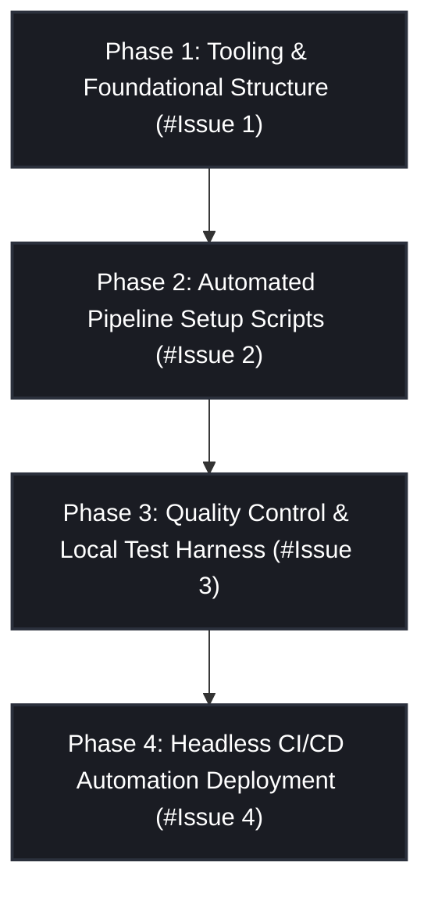

<!-- docs/designs/0002-automated-and-manual-documentation-system-v0.1.md -->
<!-- SPDX-FileCopyrightText: Copyright (C) 2026 Sebastien Lenard <sebastien.lenard@gmail.com> and Contributors -->
<!-- SPDX-License-Identifier: Apache-2.0 -->

# 0002: Automated and Manual Documentation System v0.1


## Context & Architectural Intent

CiteCraft requires a robust, dual-track documentation system that scales from a solo developer to an open-source or team-driven ecosystem. 

This system must cleanly segregate:
1. **Manual Design Plans (Architecture Decision Records):** Static, historical ledgers tracking evolutionary changes, technical choices, and implementation roadmaps.
2. **Automated API Reference Documents:** Dynamic, structural specifications automatically extracted from inline Python source code docstrings.

To enforce maximum stability, the entire infrastructure is managed via `uv`, validated natively through `ruff` rulesets, verified by programmatic smoke tests inside `pytest`, and strictly deployed via a fail-fast GitHub Actions CI/CD pipeline to GitHub Pages.

**Architectural Decision Note:** The system employs a programmatic documentation routing architecture using generate_docs.py via the native mkdocs-gen-files plugin hook. This completely automates recursive API module mapping into a virtual, transient in-memory filesystem during compilation, keeping the physical Git tree completely clean while providing granular, programmatic exclusion filtering over internal package layers like ui/ and executable entrypoints.

---

## 🤖 LLM GUARDRAILS & AMBIGUITY COMPLIANCE

> [!IMPORTANT]
> **CRITICAL EXECUTION CONSTRAINTS FOR AI CODING ASSISTANTS:**
> * **NO DEPRECATED PATTERNS:** Do not use Sphinx or reStructuredText (`.rst`). The designated standard is Markdown via `mkdocs` and `mkdocstrings`.
> * **NO VIRTUAL ENVIRONMENT MISMANAGEMENT:** Do not use `pip`, `poetry`, or standard `pipenv`. Every dependency addition, environment compilation, or execution script must route directly through `uv` (e.g., `uv add`, `uv run`).
> * **STRICT DOCSTRING STYLE CONVENTION:** All extracted code documentation must strictly match the Google Docstring layout specification. Do not use NumPy or Sphinx docstring formats.
> * **IMPORTS ONLY DURING COMPILATION:** Ensure all Python files are safely importable by a static evaluation tool. Do not execute network requests, system environment extractions, or filesystem writes at the global module layout level; encapsulate execution logic inside functional blocks to prevent compilation phase crashes.

---

## Implementation Phases & Issue Breakdown

This roadmap is split into four distinct phases, each mapped to a single tracking issue. Every step within a phase constitutes an independent, atomically committable increment that leaves the repository in a fully functional state.



---

### Phase 1: Tooling Infrastructure and Foundational Directory Topology

**Tracking Issue:** `#1 - Scaffold Documentation Tooling and Core Layout`

#### Step 1.1: Install core documentation dependencies into the development group

Install `mkdocs`, the Material theme framework, the automated python extraction extension, and the dynamic generation plugin using `uv`.

* **Commit Message:** `maint: install mkdocs, mkdocs-material, mkdocstrings, and mkdocs-gen-files dev dependencies`
* **Execution Command:**
```bash
uv add --group dev mkdocs-material mkdocs-gen-files "mkdocstrings[python]"

```


#### Step 1.2: Establish the isolated documentation file system topology

Construct the physical separation between historical design documentation and runtime programmatic reference blueprints.

* **Commit Message:** `docs: scaffold structural subdirectories for designs and reference layouts`
* **File Tree Target:**
```text
citecraft/
└── docs/
    ├── index.md
    └── designs/
        └── index.md

```


#### Step 1.3: Draft project welcome introduction landing page

Initialize the core markdown documentation files with baseline structural content.

* **Commit Message:** `docs: initialize root documentation welcome guide and design ledger index`
* **File Content Requirements (`docs/index.md`):**
  Create a clean landing page containing a `# CiteCraft` main header, a brief description of the tool as a bibliography generator for manuscripts, a "Features" bulleted list, and a quick-start "Installation" section block using `uv`.
* **File Content Requirements (`docs/designs/index.md`):**
  Create an index tracking design choices containing a `# Architecture & Design Plans` main header, a short narrative paragraph introducing the purpose of Architecture Decision Records (ADRs), and an initial Markdown list linking to these first design documents: `*[0001: CustomTkinter Architecture](0001-customtkinter-architecture-v0.1.md)`, `* [0002: Automated and Manual Documentation System](0002-automated-and-manual-documentation-system-v0.1.md)`.

#### Step 1.4: Author the core structural engine configurations

Create the `mkdocs.yml` file in the project root directory. Configure the Slate dark palette theme standard, set up required plugins, and implement the initial navigation topology layout.

* **Commit Message:** `config: create primary mkdocs.yml file configuration with slate theme and plugins`
* **Code Reference (`mkdocs.yml`):**
```yaml
site_name: CiteCraft Documentation
theme:
  name: material
  palette:
    scheme: slate
    primary: teal
    accent: teal
  features:
    - navigation.tabs
    - content.code.copy

plugins:
  - search
  - gen-files:
      scripts:
        - generate_docs.py
  - mkdocstrings:
      handlers:
        python:
          options:
            python_version: "3.12"
            docstring_style: google
            show_root_heading: true
            show_source: true
            heading_level: 2

nav:
  - Welcome: index.md
  - Architecture & Design Plans:
    - Overview: designs/index.md
  - Technical API Reference: reference/

```


---

### Phase 2: Automated Pipeline Setup Scripts

**Tracking Issue:** `#2 - Integrate Dynamic Code Documentation Generator`

#### Step 2.1: Write the automated file system parsing script

Create a Python script named `generate_docs.py` in the root of the project to recursively inspect your `src/` layout and dynamically map source modules to virtual documentation anchors.

* **Commit Message:** `tools: implement automatic file system mapper script for live api documentation`
* **Code Reference (`generate_docs.py`):**
```python
"""Automated documentation generation routing script for MkDocs."""

from pathlib import Path
import mkdocs_gen_files

src_root = Path("src/citecraft")

print(f"[generate_docs] Starting automated API reference mapping from: {src_root}")

# Walk through the source code repository systematically
for path in sorted(src_root.rglob("*.py")):
    if path.name == "__main__.py":
        print(f"[generate_docs] Skipping excluded system asset: {path.relative_to(src_root.parent)}")
        # Skip package markers and specific front-end GUI assets if desired
        continue

    relative_path = path.relative_to(src_root)

    # If it's a package marker, route its documentation to the directory's index file
    if path.name == "__init__.py":
        module_path = relative_path.parent
        doc_path = relative_path.parent / "index.md"
        # Force the root package name onto the import path string parts
        importable_module = ".".join(("citecraft", *module_path.parts))
    else:
        module_path = relative_path.with_suffix("")
        doc_path = relative_path.with_suffix(".md")
        # Force the root package name onto the import path string parts
        importable_module = ".".join(("citecraft", *module_path.parts))

    # Handle top-level bare module edge-cases (like an __init__.py in the package root)
    if not importable_module or importable_module == "citecraft.":
        importable_module = "citecraft"

    full_doc_path = Path("reference", doc_path)

    # Open a virtual file stream inside the transient MkDocs build engine
    with mkdocs_gen_files.open(full_doc_path, "w") as active_file:
        heading = module_path.parts[-1] if module_path.parts else "citecraft"
        active_file.write(f"# {heading}\n\n")
        active_file.write(f"::: {importable_module}\n")

    print(f"[generate_docs] Mapped virtual route: {importable_module} -> {full_doc_path}")

    mkdocs_gen_files.set_edit_path(full_doc_path, path)

print("[generate_docs] Documentation structure generation phase completed successfully.")
```


---

### Phase 3: Quality Control & Local Test Harness

**Tracking Issue:** `#3 - Enforce Linting Rules and Programmatic Smoke Tests`

#### Step 3.1: Enable static docstring validation policies inside Ruff

Modify the project's root `pyproject.toml` configuration file to enforce strict Google-style compliance checks across all codebase docstrings.

* **Commit Message:** `config: activate ruff d-ruleset parameters for google docstring validation`
* **Code Reference (`pyproject.toml`):**
```toml
[tool.ruff.lint]
select = ["E", "F", "I", "B", "A", "ANN", "ARG", "BLE", "C4", "C90", "COM", "D", "DTZ", "EM", "ERA", "EXE", "FA", "FBT", "FIX", "FLY", "G", "ICN", "INP", "ISC", "LOG", "N", "PERF", "PL", "PT", "Q", "RET", "RSE", "RUF", "S", "SIM", "SLF", "UP", "T10", "T20", "YTT"]
ignore = ["ISC001"] # for Ruff format

[tool.ruff.lint.pydocstyle]
convention = "google"

[tool.ruff.lint.per-file-ignores]
"tests/**/*.py" = [
    "ARG001", # Allow apparently non accessed arguments
    "ARG005", # Allow apparently non accessed arguments
    "BLE001",  # Allow broad exception catching (great for checking fallback paths)
    "FBT001",   # Positional booleans are acceptable in pytest parametrization
    "PLR2004", # Allow numerical values not being constant
    "S101",    # Asserts are native to pytest execution suites
    "PLW0120", # Allow loose control structures if an LLM generated messy loop edge-case tests
    "PLR0913", # Allow many arguments
]
"__init__.py" = ["D"]
"__main__.py" = ["D"]

```


#### Step 3.2: Implement programmatic validation integration test

Write a unit test inside the `tests/` directory that programmatically invokes the documentation engine compiler wrapper to ensure configuration integrity locally before code pushes occur.

* **Commit Message:** `test: add compilation validation integration test using the mkdocs core library API`
* **Code Reference (`tests/integration/test_docs.py`):**
```python
"""Verification harness ensuring automated documentation build execution succeeds."""

import logging
from pathlib import Path
import pytest
from mkdocs.commands.build import build
from mkdocs.config import load_config

logger = logging.getLogger(__name__)

@pytest.mark.integration
def test_documentation_build_succeeds(tmp_path: Path) -> None:
    """Verify the MkDocs compiler runs and generates the API site without crashing."""
    config = load_config("mkdocs.yml")
    config["site_dir"] = str(tmp_path / "site")

    try:
        build(config)
    except Exception as err:
        logger.exception("MkDocs internal compiler execution encountered a fault.")
        pytest.fail(f"Documentation compilation failed dynamically: {err}")
```


---

### Phase 4: Headless CI/CD Automation Deployment

**Tracking Issue:** `#4 - Construct Automated Documentation Delivery Pipeline Workflow`

#### Step 4.1: Establish fail-fast deployment workflow action

Create a GitHub Actions workflow configuration file at `.github/workflows/docs.yml` to automatically verify, build, and publish the documentation assets to GitHub Pages on every single push tracking to the protected `main` execution timeline.

* **Commit Message:** `ci: build automated workflows for documentation verification and gh-pages publishing`
* **Code Reference (`.github/workflows/docs.yml`):**
```yaml
name: Deploy Documentation Pipeline

on:
  push:
    branches: [ "main" ]

permissions:
  contents: write

jobs:
  deploy-docs:
    runs-on: ubuntu-latest
    steps:
      - name: Checkout Source Code
        uses: actions/checkout@v4.2.2

      - name: Provision Python Environment
        uses: astral-sh/setup-uv@v5.3.0
        with:
          python-version: "3.12.9"

      - name: Install Development Dependencies
        run: uv sync --frozen --group dev

      - name: Verify Documentation Compilation Integrity (Strict Mode)
        run: uv run mkdocs build --strict

      - name: Deploy Production Documentation to GitHub Pages
        run: |
          git config user.name github-actions[bot]
          git config user.email 41898282+github-actions[bot]@users.noreply.github.com
          uv run mkdocs gh-deploy --force

```
